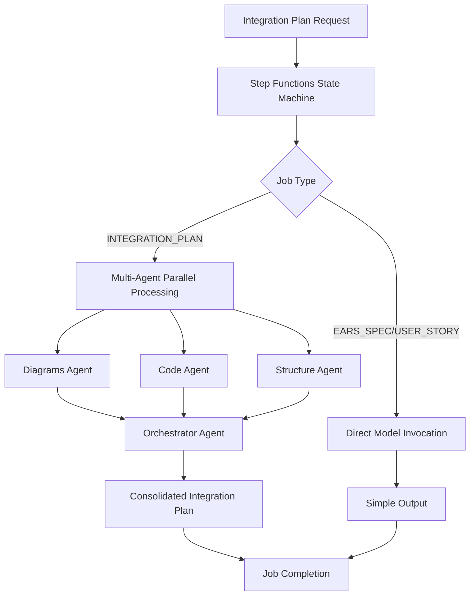

# Multi-Agent Architecture Setup

## Overview

The SpecGen AI backend has been refactored to use a sophisticated multi-agent approach for generating comprehensive API integration plans. This architecture leverages specialized AI agents for different aspects of the integration plan generation, ensuring high-quality, consistent, and production-ready outputs.

## Architecture Components

### 1. Agent Types

#### **Architecture & Diagram Generation Agent** (`diagrams`)
- **Purpose**: Generate comprehensive system architecture diagrams
- **Specialization**: Cloud-native architectures, microservices, enterprise integration patterns
- **Output**: Mermaid diagrams for high-level, low-level, sequence, security, and deployment architectures
- **Environment Variables**: 
  - `BEDROCK_DIAGRAM_AGENT_ID`
  - `BEDROCK_DIAGRAM_AGENT_ALIAS_ID`

#### **Developer & Code Agent** (`code`)
- **Purpose**: Generate production-ready code templates and API specifications
- **Specialization**: TypeScript/JavaScript, OpenAPI specs, security implementations, testing
- **Output**: Complete code templates, DTOs, API implementations, testing frameworks
- **Environment Variables**: 
  - `BEDROCK_CODE_AGENT_ID`
  - `BEDROCK_CODE_AGENT_ALIAS_ID`

#### **Project Structure & Solution Architect Agent** (`structure`)
- **Purpose**: Design enterprise-grade project organization and implementation guides
- **Specialization**: DevOps, infrastructure, project architecture, CI/CD pipelines
- **Output**: Complete project structures, deployment strategies, operational guides
- **Environment Variables**: 
  - `BEDROCK_STRUCTURE_AGENT_ID`
  - `BEDROCK_STRUCTURE_AGENT_ALIAS_ID`

#### **Integration Plan Orchestrator Agent** (`orchestrator`)
- **Purpose**: Consolidate all specialized outputs into a unified integration plan
- **Specialization**: Technical program management, cross-cutting concerns, quality validation
- **Output**: Master integration plan with executive summary and implementation roadmap
- **Environment Variables**: 
  - `BEDROCK_ORCHESTRATOR_AGENT_ID`
  - `BEDROCK_ORCHESTRATOR_AGENT_ALIAS_ID`

### 2. Execution Flow



## Environment Variables Configuration

### Required Variables

```bash
# Base Bedrock Configuration
AWS_REGION=ap-south-1
BEDROCK_MODEL_ID=apac.amazon.nova-pro-v1:0

# Default Agent (used for simple jobs and fallback)
BEDROCK_AGENT_ID=EDZEP7ZPCP
BEDROCK_AGENT_ALIAS_ID=UAHRZEARPW

# Specialized Agents for Complex Jobs
BEDROCK_DIAGRAM_AGENT_ID=your-diagram-agent-id
BEDROCK_DIAGRAM_AGENT_ALIAS_ID=your-diagram-agent-alias-id

BEDROCK_CODE_AGENT_ID=your-code-agent-id
BEDROCK_CODE_AGENT_ALIAS_ID=your-code-agent-alias-id

BEDROCK_STRUCTURE_AGENT_ID=your-structure-agent-id
BEDROCK_STRUCTURE_AGENT_ALIAS_ID=your-structure-agent-alias-id

BEDROCK_ORCHESTRATOR_AGENT_ID=your-orchestrator-agent-id
BEDROCK_ORCHESTRATOR_AGENT_ALIAS_ID=your-orchestrator-agent-alias-id

# Feature Flags
USE_MULTI_AGENT=true
USE_MOCK_SERVICES=false
```

### Fallback Configuration

If specialized agent IDs are not provided, the system will fall back to the default agent:

```bash
# Minimum Configuration (uses default agent for all tasks)
BEDROCK_AGENT_ID=EDZEP7ZPCP
BEDROCK_AGENT_ALIAS_ID=UAHRZEARPW
```

## Implementation Details

### 1. BedrockService Refactoring

The `BedrockService` now supports multiple invocation methods:

- **`generateContentWithModel()`**: Direct model invocation for simple jobs
- **`generateContentWithAgent()`**: Specialized agent invocation for complex tasks
- **`generateContent()`**: Legacy method with intelligent routing

### 2. Task-Specific Processing

Each complex job task is processed by its specialized agent:

```typescript
// processComplexJob.ts
switch (task) {
  case 'diagrams':
    agentType = 'diagrams';
    // Uses Architecture & Diagram Generation Agent
    break;
  case 'code':
    agentType = 'code';
    // Uses Developer & Code Agent
    break;
  case 'structure':
    agentType = 'structure';
    // Uses Project Structure & Solution Architect Agent
    break;
}
```

### 3. Orchestrator Consolidation

The final consolidation step uses the Orchestrator Agent to:
- Synthesize all outputs into a cohesive narrative
- Ensure consistency between diagrams, code, and project structure
- Provide executive summary and business context
- Include implementation roadmap and success metrics

## Benefits of Multi-Agent Architecture

### 1. **Specialization & Quality**
- Each agent is optimized for specific tasks
- Higher quality outputs through domain expertise
- Consistent patterns within each domain

### 2. **Scalability**
- Independent scaling of different agent types
- Parallel processing of complex jobs
- Reduced processing time for large integration plans

### 3. **Maintainability**
- Clear separation of concerns
- Easy to update individual agent capabilities
- Simplified debugging and monitoring

### 4. **Flexibility**
- Support for both simple and complex workflows
- Graceful fallback to default agent
- Feature flag control for multi-agent usage

## Configuration Best Practices

### 1. **Agent Assignment**
- Use different agent IDs for better specialization
- Consider using the same agent ID with different aliases for cost optimization
- Monitor agent performance and adjust as needed

### 2. **Environment Management**
- Use different agent configurations per environment (dev/staging/prod)
- Implement proper secret management for agent credentials
- Monitor agent usage and costs

### 3. **Fallback Strategy**
- Always configure default agent as fallback
- Implement proper error handling for agent failures
- Use feature flags to disable multi-agent if needed

## Monitoring and Logging

### 1. **Agent Tracking**
Each request includes comprehensive metadata:

```typescript
metadata: {
  agentId: 'agent-id',
  agentType: 'diagrams',
  sessionId: 'session-id',
  mode: 'agent'
}
```

### 2. **Performance Monitoring**
- Track response times per agent type
- Monitor agent availability and error rates
- Analyze cost per agent and optimization opportunities

### 3. **Quality Metrics**
- Track job completion rates by agent type
- Monitor user satisfaction with different agent outputs
- Implement feedback loops for continuous improvement

## Troubleshooting

### Common Issues

1. **Agent Not Found**: Verify agent IDs and alias IDs are correct
2. **Permission Denied**: Ensure IAM roles have access to invoke agents
3. **Fallback to Default**: Check if specialized agent IDs are configured
4. **Inconsistent Outputs**: Verify agent prompts and system messages are aligned

### Debug Configuration

```bash
# Enable debug mode for detailed logging
DEBUG_MODE=true
NODE_ENV=development
USE_MOCK_SERVICES=true  # For local testing
```

## Migration Guide

### From Single Agent to Multi-Agent

1. **Update Environment Variables**: Add specialized agent configurations
2. **Test Fallback**: Ensure system works with missing agent IDs
3. **Monitor Performance**: Compare output quality and processing times
4. **Gradual Rollout**: Use feature flags to gradually enable multi-agent processing

### Backward Compatibility

The refactored system maintains full backward compatibility:
- Existing API contracts unchanged
- Legacy frontend continues to work
- Single agent configuration still supported
- Graceful degradation when agents unavailable

---

This multi-agent architecture provides a robust, scalable foundation for generating enterprise-grade API integration plans while maintaining flexibility and reliability.