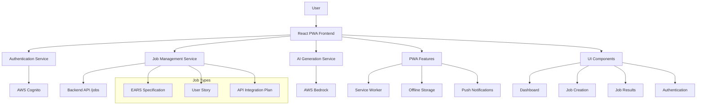
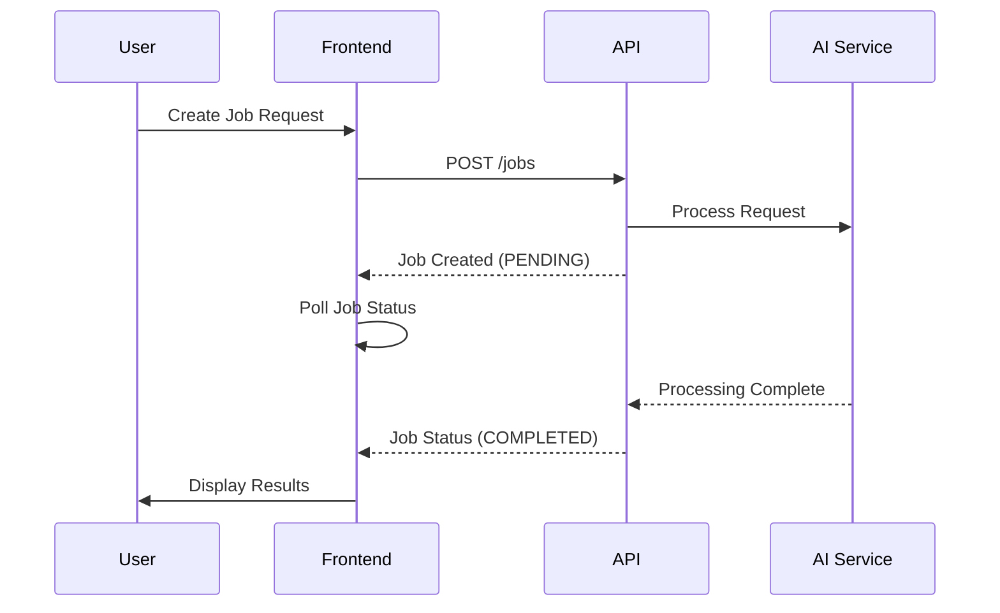

# SpecGen AI Frontend

A modern React PWA (Progressive Web App) for the SpecGen AI application that generates AI-powered specifications, user stories, and API integration plans.

## 🚀 Features

- **Modern React 18** with TypeScript and Vite
- **Progressive Web App** with offline support and installable
- **AWS Amplify Integration** for authentication and API calls
- **TailwindCSS** for responsive, modern UI design
- **Mermaid Diagrams** for architecture visualization
- **Real-time Job Status** with automatic polling
- **Code Syntax Highlighting** with React Syntax Highlighter
- **Markdown Rendering** with React Markdown
- **Mobile-First Design** with responsive navigation
- **Error Boundaries** for robust error handling
- **React Query** for efficient data fetching and caching

## 🏗️ Architecture



## 📋 Prerequisites

- Node.js 18+ and npm
- AWS Account with Cognito User Pool configured
- Backend API deployed and running

## 🛠️ Installation

1. **Clone the repository**
   ```bash
   git clone <repository-url>
   cd packages/frontend
   ```

2. **Install dependencies**
   ```bash
   npm install
   ```

3. **Environment Configuration**
   ```bash
   cp .env.example .env
   ```
   
   Configure your environment variables:
   ```env
   VITE_AWS_REGION=us-east-1
   VITE_USER_POOL_ID=your-user-pool-id
   VITE_USER_POOL_CLIENT_ID=your-user-pool-client-id
   VITE_API_ENDPOINT=https://api.specgen.ai
   ```

4. **Start development server**
   ```bash
   npm run dev
   ```

## 🏃‍♂️ Available Scripts

- `npm run dev` - Start development server
- `npm run build` - Build for production
- `npm run preview` - Preview production build
- `npm run test` - Run tests
- `npm run lint` - Run ESLint
- `npm run type-check` - Run TypeScript type checking

## 📱 PWA Features

### Installation
- **Auto-prompt** for app installation on supported browsers
- **Offline functionality** with service worker caching
- **App-like experience** when installed

### Service Worker
- **Background sync** for failed requests
- **Push notifications** for job completion
- **Automatic updates** with user prompts

## 🎨 UI Components

### Pages
- **Dashboard** - Job overview with statistics and recent jobs
- **Create Job** - Interactive form for creating new AI generation jobs
- **Job Results** - Comprehensive display of generated content with:
  - Markdown specifications
  - Mermaid architecture diagrams
  - Code snippets with syntax highlighting
  - Project structure visualization

### Core Components
- **Layout** - Responsive navigation with mobile support
- **AuthContext** - AWS Cognito authentication management
- **PWAInstaller** - Install prompts and update notifications
- **ErrorBoundary** - Graceful error handling
- **LoadingSpinner** - Consistent loading states

## 🔧 Technical Stack

### Frontend Framework
- **React 18** - Component-based UI library
- **TypeScript** - Type-safe development
- **Vite** - Fast build tool and dev server

### Styling & UI
- **TailwindCSS** - Utility-first CSS framework
- **Lucide React** - Beautiful SVG icons
- **Custom Components** - Reusable UI components

### State Management
- **React Query** - Server state management
- **Zustand** - Client state management
- **React Hook Form** - Form state management

### Authentication & API
- **AWS Amplify** - Authentication and API integration
- **Axios** - HTTP client for API calls

### Content Rendering
- **React Markdown** - Markdown content rendering
- **React Syntax Highlighter** - Code syntax highlighting
- **Mermaid** - Diagram rendering

### PWA Features
- **Vite PWA Plugin** - Service worker generation
- **Workbox** - PWA runtime caching strategies

## 🔐 Authentication Flow

1. **User visits app** - Redirected to Cognito sign-in if not authenticated
2. **AWS Cognito** - Handles sign-up, sign-in, and token management
3. **JWT Tokens** - Used for authenticated API requests
4. **Auto-refresh** - Tokens refreshed automatically
5. **Sign-out** - Clears tokens and redirects to sign-in

## 📊 Job Management Flow



## 🎯 Job Types

### EARS Specification
- Generates detailed requirements documentation
- Creates high-level and low-level design diagrams
- Includes acceptance criteria and test scenarios

### User Story Generation
- Transforms requirements into user stories
- Generates acceptance criteria
- Creates story mapping and prioritization

### API Integration Plan
- Creates comprehensive integration documentation
- Generates code examples and DTOs
- Includes project structure and implementation guides

## 🚀 Deployment

### Production Build
```bash
npm run build
```

### Environment Variables
Ensure all required environment variables are set:
- `VITE_AWS_REGION`
- `VITE_USER_POOL_ID`
- `VITE_USER_POOL_CLIENT_ID`
- `VITE_API_ENDPOINT`

### Hosting Options
- **AWS Amplify Hosting** - Recommended for AWS integration
- **Vercel** - Fast global CDN deployment
- **Netlify** - JAMstack hosting platform
- **AWS S3 + CloudFront** - Custom AWS hosting setup

## 🧪 Testing

### Unit Tests
```bash
npm run test
```

### Type Checking
```bash
npm run type-check
```

### Linting
```bash
npm run lint
```

## 📈 Performance Optimizations

- **Code Splitting** - Automatic route-based splitting
- **Tree Shaking** - Remove unused code
- **Image Optimization** - Responsive images with lazy loading
- **Service Worker Caching** - Cache API responses and assets
- **React Query Caching** - Intelligent data caching and invalidation

## 🔧 Development

### Project Structure
```
src/
├── components/          # Reusable UI components
│   ├── common/         # Generic components
│   ├── ErrorBoundary.tsx
│   ├── Layout.tsx
│   └── PWAInstaller.tsx
├── contexts/           # React contexts
│   └── AuthContext.tsx
├── pages/             # Route components
│   ├── Dashboard.tsx
│   ├── CreateJob.tsx
│   └── JobResults.tsx
├── services/          # API and external services
│   └── api.ts
├── App.tsx           # Main app component
├── main.tsx          # App entry point
└── index.css         # Global styles
```

### Adding New Features
1. Create component in appropriate directory
2. Add routing if needed in `App.tsx`
3. Update navigation in `Layout.tsx`
4. Add API calls in `services/api.ts`
5. Update types and interfaces

## 🐛 Troubleshooting

### Common Issues

**Authentication Errors**
- Verify Cognito User Pool configuration
- Check environment variables
- Ensure CORS is configured on backend

**API Connection Issues**
- Verify API endpoint URL
- Check network connectivity
- Validate JWT token format

**PWA Installation Issues**
- Ensure HTTPS in production
- Verify manifest.json configuration
- Check service worker registration

### Debug Mode
Set `NODE_ENV=development` to enable:
- Detailed error messages
- Component stack traces
- Development tools integration

## 📄 License

This project is licensed under the MIT License - see the LICENSE file for details.

## 🤝 Contributing

1. Fork the repository
2. Create a feature branch
3. Make your changes
4. Add tests if applicable
5. Submit a pull request

## 📞 Support

For support and questions:
- Create an issue in the repository
- Contact the development team
- Check the documentation wiki