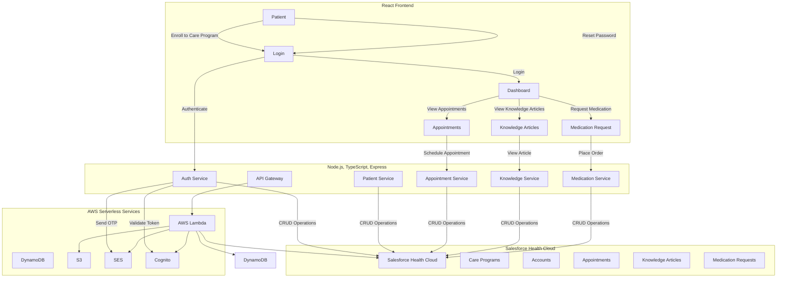
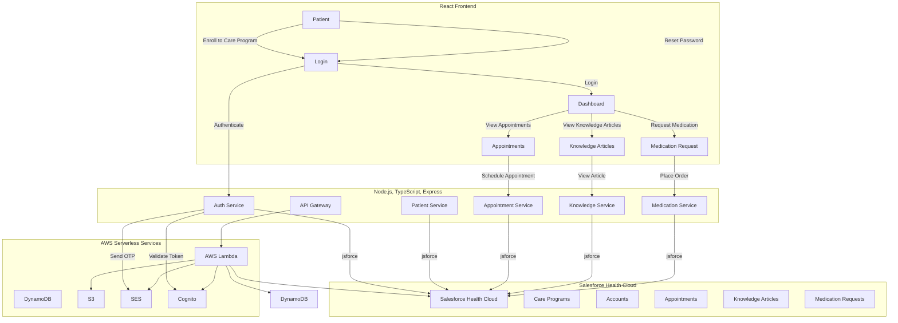
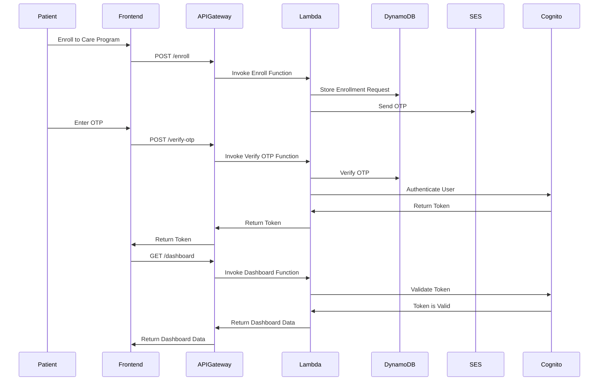
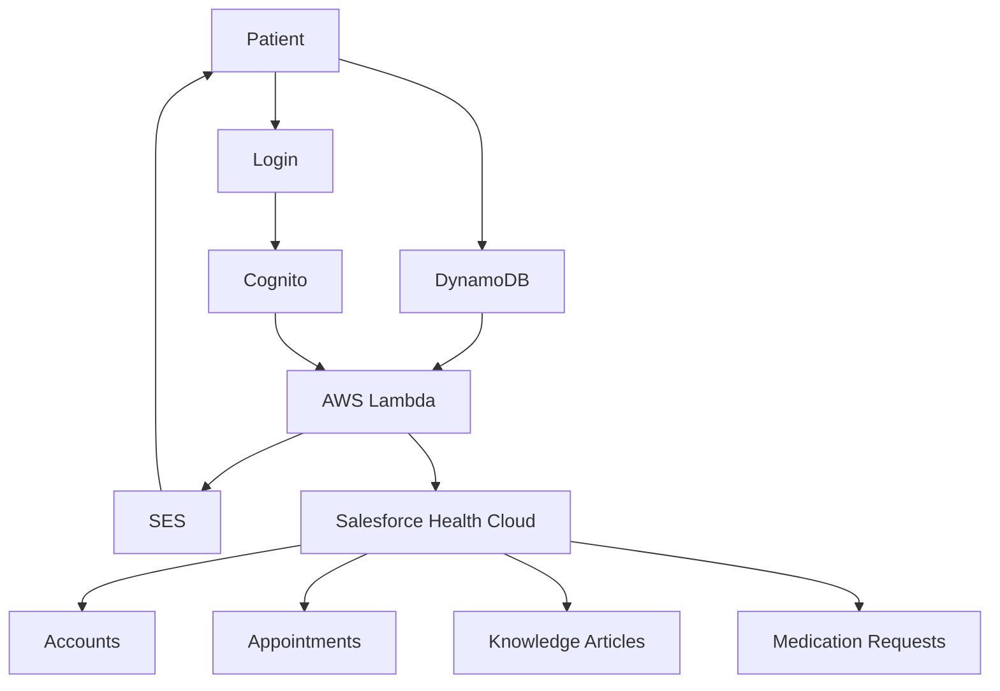
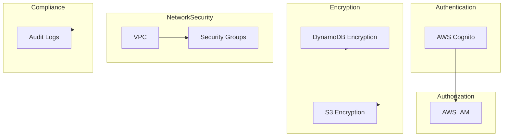
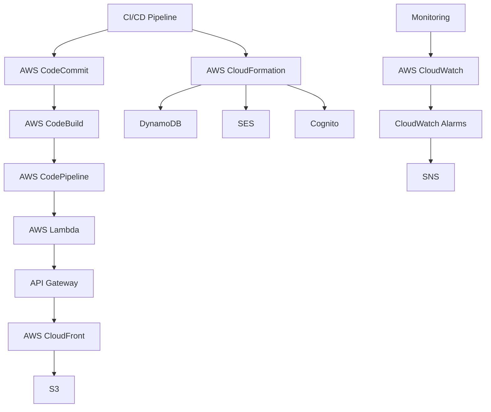

Certainly! Below are the Mermaid syntax diagrams for the requested Salesforce integration platform using AWS Serverless Services with Node.js, TypeScript, and Express for CRUD operations on Salesforce Health Cloud objects. The frontend is built with React.

### 1. High-Level System Architecture

### 2. Low-Level Design Architecture

### 3. Sequence Diagrams

#### User Enrollment and Authentication Flow

### 4. Data Flow Architecture

### 5. Security Architecture

### 6. Deployment Pipeline Architecture

These diagrams provide a comprehensive view of the architecture, from high-level components to detailed interactions, data flows, security measures, and deployment pipelines.