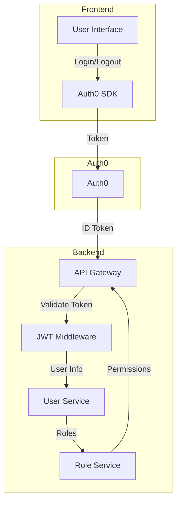
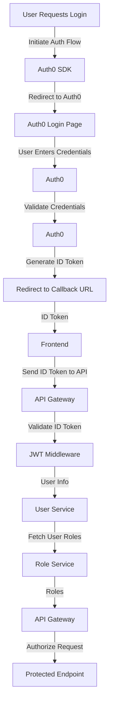
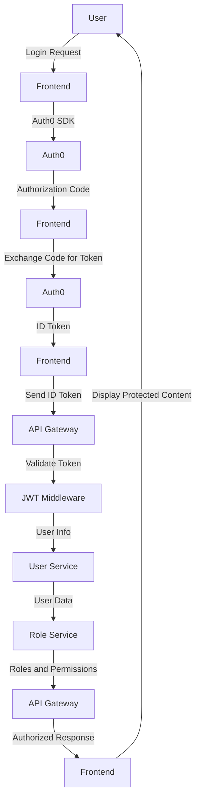
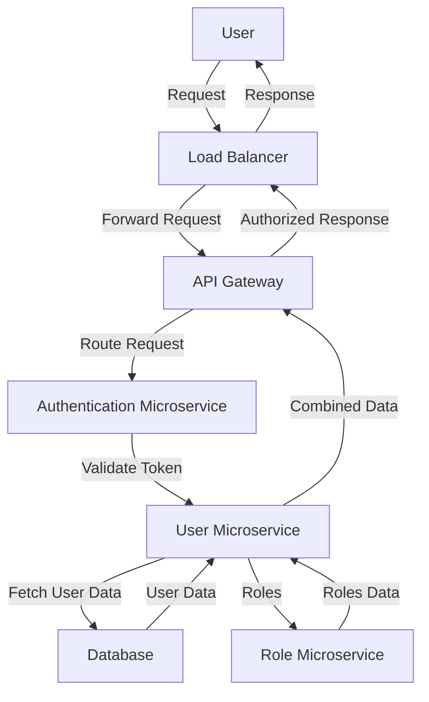
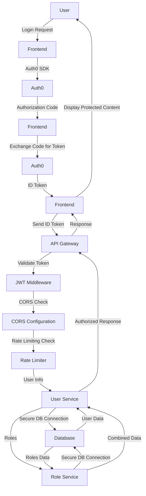

# API Integration Plan

## EARS Authentication Service Integration Plan

### 1. Executive Summary and Integration Overview

This integration plan outlines the steps required to replace the existing authentication system with [Auth0/AWS Cognito/Firebase Auth] using OAuth 2.0/OpenID Connect. The plan includes migrating existing user data, implementing JWT token-based authentication, and adding role-based access control (RBAC). The goal is to enhance security, scalability, and user experience while ensuring a smooth transition.

### 2. System Architecture and Component Design

**Architecture Diagram:**


**Components:**
- **Frontend Application:** React/Angular/Vue.js application consuming the authentication service.
- **Backend API:** RESTful API built using Node.js/Express or similar.
- **Authentication Service:** [Auth0/AWS Cognito/Firebase Auth].
- **Database:** User data storage (e.g., PostgreSQL, MongoDB).

**Interaction Flow:**
1. User initiates login via Frontend.
2. Frontend redirects to Authentication Service for OAuth flow.
3. Upon successful authentication, the Authentication Service returns an ID Token and Access Token.
4. Frontend stores tokens and makes API requests with the Access Token.
5. Backend validates the Access Token and processes the request if valid.

### 3. API Specifications and Data Contracts

**Authentication Endpoints:**

- **POST /auth/login**
  - Request: None
  - Response: Redirect to Authentication Service login page

- **GET /auth/callback**
  - Request: `code` (OAuth authorization code)
  - Response: 
    ```json
    {
      "id_token": "string",
      "access_token": "string",
      "refresh_token": "string",
      "expires_in": 3600
    }
    ```

- **POST /auth/refresh**
  - Request: 
    ```json
    {
      "refresh_token": "string"
    }
    ```
  - Response: 
    ```json
    {
      "access_token": "string",
      "expires_in": 3600
    }
    ```

- **POST /auth/logout**
  - Request: None
  - Response: Redirect to Authentication Service logout endpoint

### 4. Security Architecture and Authentication

**JWT Validation:**
- Backend will validate JWT tokens using the public key provided by the Authentication Service.
- Implement CORS to allow only trusted origins.
- Rate limiting on `/auth/login` and `/auth/refresh` endpoints to prevent abuse.

**Password Reset and Email Verification:**
- Secure flows using temporary tokens with short expiration times.
- Emails should be sent via a secure SMTP server.

### 5. Error Handling and Resilience Patterns

**Error Handling:**
- Standardize error responses:
  ```json
  {
    "error": "invalid_token",
    "error_description": "The access token is invalid"
  }
  ```
- Implement retry logic for token refresh with exponential backoff.

**Resilience Patterns:**
- Circuit breaker pattern for external service calls.
- Fallback mechanisms for critical authentication paths.

### 6. Testing Strategy and Quality Assurance

**Testing Approach:**
- **Unit Tests:** Test individual components (e.g., JWT middleware, user role validation).
- **Integration Tests:** Test the interaction between Frontend, Backend, and Authentication Service.
- **End-to-End Tests:** Simulate user flows including login, token refresh, and protected resource access.
- **Penetration Testing:** Conduct security audits and penetration tests on the authentication flows.

### 7. Deployment and Operations Guide

**Deployment Pipeline:**
1. **CI/CD Setup:** Use tools like Jenkins, GitHub Actions, or GitLab CI.
2. **Environments:** Develop, Stage, Production.
3. **Rollback Procedure:** Automated rollback on deployment failure using version control.

**Configuration Examples:**
- `.env` file for storing sensitive information.
- Example configuration for Auth0:
  ```env
  AUTH0_DOMAIN=your-auth0-domain.auth0.com
  AUTH0_CLIENT_ID=your-client-id
  AUTH0_CLIENT_SECRET=your-client-secret
  AUTH0_CALLBACK_URL=http://your-app-url/auth/callback
  ```

### 8. Monitoring and Observability

**Monitoring Tools:**
- Use Prometheus and Grafana for metrics.
- ELK Stack (Elasticsearch, Logstash, Kibana) for logging.
- Set up alerting using tools like PagerDuty or OpsGenie.

**Metrics to Monitor:**
- Authentication success/failure rates.
- Token refresh rates.
- API response times.

### 9. Performance and Scalability Considerations

**Performance Optimization:**
- Cache frequently accessed data.
- Use CDN for static assets.
- Horizontally scale the backend using load balancers.

**Scalability:**
- Design stateless services to allow easy scaling.
- Use managed services for databases and authentication to handle increased load.

### 10. Risk Assessment and Mitigation

**Identified Risks:**
- **Data Breach:** Implement encryption for data at rest and in transit.
- **Service Downtime:** Use redundant systems and failover mechanisms.
- **Unauthorized Access:** Enforce strong authentication and authorization policies.

**Mitigation Strategies:**
- Regular security audits and penetration testing.
- Implement multi-factor authentication (MFA) where possible.
- Maintain up-to-date dependencies and patches.

### Implementation Guidance

**Step-by-Step Approach:**

1. **Setup Authentication Service:**
   - Create an account on [Auth0/AWS Cognito/Firebase Auth].
   - Configure application settings (client ID, secret, callback URLs).

2. **Frontend Changes:**
   - Install authentication SDK (e.g., `auth0-js` for Auth0).
   - Implement login/logout flows.
   - Protect routes using authentication hooks.

3. **Backend Changes:**
   - Add JWT middleware for route protection.
   - Validate user roles and permissions.
   - Create endpoints for user profile management.

4. **Migration Strategy:**
   - Develop user migration scripts to transfer existing users to the new system.
   - Implement feature flags for gradual rollout.
   - Provide fallback authentication during the transition period.

5. **Testing and Validation:**
   - Execute unit, integration, and end-to-end tests.
   - Perform security penetration testing.

6. **Deployment:**
   - Deploy changes through the CI/CD pipeline.
   - Monitor the system closely during and after deployment.

7. **Monitoring and Alerting:**
   - Set up monitoring dashboards.
   - Configure alerts for critical metrics.

By following this comprehensive integration plan, development teams can effectively implement the new authentication system, ensuring security, performance, and a smooth user experience.

---

## Architecture Diagrams

Below are the Mermaid diagrams for the Authentication Service Integration Plan using Auth0 as the authentication provider.

### 1. High-Level System Architecture



### 2. Low-Level Design with Detailed Interactions



### 3. Data Flow Diagrams



### 4. Deployment Architecture



### 5. Security Architecture Overview



---

## Code Templates & Implementation

Below are the comprehensive code templates and API specifications for integrating an authentication service (Auth0, AWS Cognito, or Firebase Auth) into an application. 

### 1. TypeScript Interfaces and DTOs

```typescript
// user.dto.ts
export interface UserDTO {
  id: string;
  email: string;
  roles: string[];
}

// auth.dto.ts
export interface LoginDTO {
  email: string;
  password: string;
}

export interface TokenDTO {
  accessToken: string;
  refreshToken: string;
}

export interface RegisterDTO {
  email: string;
  password: string;
  roles?: string[];
}
```

### 2. API Client Implementations

```typescript
// auth.client.ts
import axios from 'axios';
import { LoginDTO, TokenDTO, RegisterDTO } from './auth.dto';

class AuthClient {
  private baseUrl: string;

  constructor(baseUrl: string) {
    this.baseUrl = baseUrl;
  }

  async login(credentials: LoginDTO): Promise<TokenDTO> {
    const response = await axios.post(`${this.baseUrl}/auth/login`, credentials);
    return response.data;
  }

  async register(userData: RegisterDTO): Promise<TokenDTO> {
    const response = await axios.post(`${this.baseUrl}/auth/register`, userData);
    return response.data;
  }

  async refreshToken(refreshToken: string): Promise<TokenDTO> {
    const response = await axios.post(`${this.baseUrl}/auth/refresh`, { refreshToken });
    return response.data;
  }
}

export default AuthClient;
```

### 3. Error Handling Patterns

```typescript
// error.ts
export class AppError extends Error {
  statusCode: number;

  constructor(message: string, statusCode: number) {
    super(message);
    this.statusCode = statusCode;
  }
}

export const handleError = (error: any, res: any) => {
  if (error instanceof AppError) {
    return res.status(error.statusCode).json({ message: error.message });
  }
  console.error(error);
  return res.status(500).json({ message: 'Internal Server Error' });
};
```

### 4. Configuration Templates

```json
// config.json
{
  "auth": {
    "baseUrl": "https://your-auth-service.com",
    "clientId": "your-client-id",
    "clientSecret": "your-client-secret"
  },
  "cors": {
    "origins": ["http://localhost:3000", "https://your-app.com"]
  },
  "rateLimit": {
    "maxRequests": 100,
    "timeWindow": "1h"
  }
}
```

### 5. Testing Templates

```typescript
// auth.client.test.ts
import axios from 'axios';
import AuthClient from './auth.client';

jest.mock('axios');

const mockedAxios = axios as jest.Mocked<typeof axios>;

describe('AuthClient', () => {
  const baseUrl = 'https://your-auth-service.com';
  const authClient = new AuthClient(baseUrl);

  it('should login successfully', async () => {
    const loginDTO: LoginDTO = { email: 'test@example.com', password: 'password' };
    const tokenDTO: TokenDTO = { accessToken: 'token', refreshToken: 'refresh_token' };

    mockedAxios.post.mockResolvedValueOnce({ data: tokenDTO });

    const result = await authClient.login(loginDTO);
    expect(result).toEqual(tokenDTO);
    expect(mockedAxios.post).toHaveBeenCalledWith(`${baseUrl}/auth/login`, loginDTO);
  });

  it('should handle login error', async () => {
    const loginDTO: LoginDTO = { email: 'test@example.com', password: 'password' };

    mockedAxios.post.mockRejectedValueOnce(new Error('Network Error'));

    await expect(authClient.login(loginDTO)).rejects.toThrow('Network Error');
  });
});
```

### 6. Database Schemas

```sql
-- users.sql
CREATE TABLE users (
  id SERIAL PRIMARY KEY,
  email VARCHAR(255) NOT NULL UNIQUE,
  password_hash VARCHAR(255) NOT NULL,
  created_at TIMESTAMP DEFAULT CURRENT_TIMESTAMP,
  updated_at TIMESTAMP DEFAULT CURRENT_TIMESTAMP
);

CREATE TABLE user_roles (
  user_id INT NOT NULL,
  role VARCHAR(50) NOT NULL,
  FOREIGN KEY (user_id) REFERENCES users (id) ON DELETE CASCADE,
  PRIMARY KEY (user_id, role)
);
```

### API Specifications

#### Authentication Endpoints

**POST /auth/login**
- **Request Body:** `{ "email": "string", "password": "string" }`
- **Response:** `{ "accessToken": "string", "refreshToken": "string" }`

**POST /auth/register**
- **Request Body:** `{ "email": "string", "password": "string", "roles": ["string"] }`
- **Response:** `{ "accessToken": "string", "refreshToken": "string" }`

**POST /auth/refresh**
- **Request Body:** `{ "refreshToken": "string" }`
- **Response:** `{ "accessToken": "string", "refreshToken": "string" }`

### Frontend Changes

#### Install Authentication SDK/Library

```bash
# For Auth0
npm install @auth0/auth0-spa-js

# For AWS Cognito
npm install amazon-cognito-identity-js

# For Firebase Auth
npm install firebase
```

#### Implement Login/Logout Flows

```javascript
// auth0.js (example for Auth0)
import createAuth0Client from '@auth0/auth0-spa-js';

let auth0Client;

export const initAuth0 = async () => {
  auth0Client = await createAuth0Client({
    domain: 'your-auth0-domain.auth0.com',
    client_id: 'your-client-id',
    redirect_uri: window.location.origin,
  });
};

export const login = async () => {
  await auth0Client.loginWithRedirect({});
};

export const logout = async () => {
  await auth0Client.logout({
    returnTo: window.location.origin,
  });
};

export const handleRedirectCallback = async () => {
  const tokens = await auth0Client.handleRedirectCallback();
  return tokens;
};
```

### Backend Changes

#### Add JWT Middleware for Route Protection

```typescript
// jwt.middleware.ts
import { Request, Response, NextFunction } from 'express';
import jwt from 'jsonwebtoken';

const secret = process.env.JWT_SECRET;

export const authenticateJWT = (req: Request, res: Response, next: NextFunction) => {
  const authHeader = req.headers.authorization;

  if (authHeader) {
    const token = authHeader.split(' ')[1];

    jwt.verify(token, secret, (err, user) => {
      if (err) {
        return res.sendStatus(403);
      }

      req.user = user;
      next();
    });
  } else {
    res.sendStatus(401);
  }
};
```

#### Implement User Role Validation

```typescript
// role.middleware.ts
import { Request, Response, NextFunction } from 'express';

export const checkRole = (role: string) => {
  return (req: Request, res: Response, next: NextFunction) => {
    if (req.user && req.user.roles.includes(role)) {
      next();
    } else {
      res.sendStatus(403);
    }
  };
};
```

### Migration Strategy

1. **Set up authentication service in parallel**
   - Configure the authentication service (Auth0, AWS Cognito, Firebase Auth) alongside the existing system.

2. **Create user migration scripts**
   - Write scripts to migrate existing user data to the new authentication service.

3. **Implement gradual rollout with feature flags**
   - Use feature flags to enable the new authentication flow for a subset of users.

4. **Provide fallback authentication during transition**
   - Allow users to authenticate via the old system if the new one fails.

### Testing and Validation

1. **Authentication flow testing**
   - Test the entire login, logout, and registration flows.

2. **Token expiration and refresh testing**
   - Ensure tokens expire correctly and can be refreshed.

3. **Role-based access testing**
   - Verify that users with different roles can access appropriate resources.

4. **Security penetration testing**
   - Conduct security testing to identify vulnerabilities in the authentication system.

---

## Project Structure & Organization

Certainly! Below is a comprehensive project structure for integrating an authentication service (Auth0/AWS Cognito/Firebase Auth) into an application.

### Project Structure

#### 1. Directory Structure

```
authentication-service-integration/
├── src/
│   ├── auth/
│   │   ├── middleware/
│   │   │   ├── authMiddleware.js
│   │   ├── services/
│   │   │   ├── authService.js
│   │   ├── utils/
│   │   │   ├── jwtUtils.js
│   ├── components/
│   │   ├── AuthButton.jsx
│   │   ├── ProtectedRoute.jsx
│   ├── pages/
│   │   ├── LoginPage.jsx
│   │   ├── DashboardPage.jsx
│   ├── api/
│   │   ├── userProfile.js
│   ├── config/
│   │   ├── authConfig.js
├── public/
│   ├── index.html
├── scripts/
│   ├── build.sh
│   ├── deploy.sh
├── tests/
│   ├── auth/
│   │   ├── authService.test.js
│   │   ├── authMiddleware.test.js
│   ├── components/
│   │   ├── AuthButton.test.jsx
│   │   ├── ProtectedRoute.test.jsx
├── docs/
│   ├── architecture.md
│   ├── api.md
│   ├── user-guide.md
├── .env
├── .gitignore
├── package.json
├── README.md
```

#### 2. `package.json` Dependencies

```json
{
  "name": "authentication-service-integration",
  "version": "1.0.0",
  "description": "Integration plan for authentication service",
  "main": "src/index.js",
  "scripts": {
    "start": "node src/index.js",
    "build": "bash scripts/build.sh",
    "deploy": "bash scripts/deploy.sh",
    "test": "jest"
  },
  "dependencies": {
    "express": "^4.17.1",
    "jsonwebtoken": "^8.5.1",
    "auth0-js": "^9.15.0", // or "@aws-amplify/auth": "^4.3.13" for AWS Cognito, or "firebase": "^9.6.4" for Firebase Auth
    "cors": "^2.8.5",
    "rate-limiter-flexible": "^2.2.1"
  },
  "devDependencies": {
    "jest": "^26.6.3",
    "supertest": "^6.1.3"
  }
}
```

#### 3. Configuration Files

- **`.env`**:
  ```plaintext
  AUTH0_DOMAIN=your-auth0-domain.auth0.com
  AUTH0_CLIENT_ID=your-auth0-client-id
  AUTH0_CLIENT_SECRET=your-auth0-client-secret
  JWT_SECRET=your-jwt-secret
  ```

- **`src/config/authConfig.js`**:
  ```javascript
  module.exports = {
    domain: process.env.AUTH0_DOMAIN,
    clientId: process.env.AUTH0_CLIENT_ID,
    clientSecret: process.env.AUTH0_CLIENT_SECRET,
    jwtSecret: process.env.JWT_SECRET
  };
  ```

#### 4. Build and Deployment Scripts

- **`scripts/build.sh`**:
  ```bash
  #!/bin/bash
  echo "Building the project..."
  # Add build commands here, e.g., for React: npm run build
  ```

- **`scripts/deploy.sh`**:
  ```bash
  #!/bin/bash
  echo "Deploying the project..."
  # Add deployment commands here, e.g., for AWS: aws s3 sync build/ s3://your-bucket-name
  ```

#### 5. Documentation Structure

- **`docs/architecture.md`**:
  ```markdown
  # Architecture Overview
  ## Components
  - Frontend: React
  - Backend: Express
  - Authentication Service: Auth0/AWS Cognito/Firebase Auth
  ## Flow
  1. User requests login
  2. Frontend redirects to Auth0/AWS Cognito/Firebase Auth
  3. User authenticates
  4. Backend validates JWT token
  ```

- **`docs/api.md`**:
  ```markdown
  # API Endpoints
  ## User Profile
  - GET /api/user
  - POST /api/user
  ```

- **`docs/user-guide.md`**:
  ```markdown
  # User Guide
  ## Login
  1. Click on the login button
  2. Authenticate via Auth0/AWS Cognito/Firebase Auth
  ## Logout
  1. Click on the logout button
  ```

#### 6. Testing Organization

- **`tests/auth/authService.test.js`**:
  ```javascript
  const authService = require('../../src/auth/services/authService');

  test('should return a JWT token', async () => {
    const token = await authService.generateToken({ userId: 1 });
    expect(token).toBeDefined();
  });
  ```

- **`tests/components/AuthButton.test.jsx`**:
  ```javascript
  import React from 'react';
  import { render, fireEvent } from '@testing-library/react';
  import AuthButton from '../../src/components/AuthButton';

  test('should render login button', () => {
    const { getByText } = render(<AuthButton />);
    expect(getByText('Login')).toBeInTheDocument();
  });
  ```

### Implementation Guide

#### Current System Analysis

- **Existing user management**: Describe how users are currently managed (e.g., database schema, user roles).
- **Current authentication method**: Describe the current method (e.g., session-based, basic auth).
- **Authorization requirements**: List roles, permissions, and any specific access control needs.

#### Integration Approach

1. **Replace existing authentication with OAuth 2.0/OpenID Connect**:
   - Set up the authentication provider (Auth0/AWS Cognito/Firebase Auth).
   - Configure the provider with your application.

2. **Implement JWT token-based authentication**:
   - Generate JWT tokens upon successful authentication.
   - Store tokens securely (e.g., HTTP-only cookies, local storage).

3. **Add role-based access control (RBAC)**:
   - Define user roles and permissions.
   - Implement middleware to check user roles on protected routes.

4. **Migrate existing user data if needed**:
   - Create scripts to transfer user data to the new authentication service.
   - Ensure data integrity during migration.

#### Technical Implementation

**Frontend Changes**:

- **Install authentication SDK/library**:
  ```bash
  npm install auth0-js // or @aws-amplify/auth or firebase
  ```

- **Implement login/logout flows**:
  ```javascript
  // src/components/AuthButton.jsx
  import { useAuth0 } from "@auth0/auth0-react";

  function AuthButton() {
    const { loginWithRedirect, logout, isAuthenticated } = useAuth0();

    return (
      isAuthenticated ? (
        <button onClick={() => logout({ returnTo: window.location.origin })}>Logout</button>
      ) : (
        <button onClick={() => loginWithRedirect()}>Login</button>
      )
    );
  }

  export default AuthButton;
  ```

- **Add protected route components**:
  ```javascript
  // src/components/ProtectedRoute.jsx
  import React from 'react';
  import { Route, Redirect } from 'react-router-dom';
  import { useAuth0 } from "@auth0/auth0-react";

  function ProtectedRoute({ component: Component, ...rest }) {
    const { isAuthenticated } = useAuth0();

    return (
      <Route
        {...rest}
        render={props =>
          isAuthenticated ? (
            <Component {...props} />
          ) : (
            <Redirect to="/login" />
          )
        }
      />
    );
  }

  export default ProtectedRoute;
  ```

- **Handle token refresh automatically**:
  Configure the authentication library to handle token refresh.

**Backend Changes**:

- **Add JWT middleware for route protection**:
  ```javascript
  // src/auth/middleware/authMiddleware.js
  const jwt = require('jsonwebtoken');

  module.exports = function (req, res, next) {
    const token = req.headers['authorization'];
    if (!token) return res.status(401).send('Access denied. No token provided.');

    try {
      const decoded = jwt.verify(token, process.env.JWT_SECRET);
      req.user = decoded;
      next();
    } catch (ex) {
      res.status(400).send('Invalid token.');
    }
  };
  ```

- **Implement user role validation**:
  ```javascript
  // src/auth/middleware/roleMiddleware.js
  module.exports = function (requiredRole) {
    return function (req, res, next) {
      if (req.user.role !== requiredRole) {
        return res.status(403).send('Access denied.');
      }
      next();
    };
  };
  ```

- **Create user profile management endpoints**:
  ```javascript
  // src/api/userProfile.js
  const express = require('express');
  const router = express.Router();
  const authMiddleware = require('../auth/middleware/authMiddleware');

  router.get('/', authMiddleware, (req, res) => {
    res.send(req.user);
  });

  module.exports = router;
  ```

- **Add authentication-required decorators/middleware**:
  Apply middleware to protected routes in your Express app.

**API Security**:

- **Validate JWT tokens on protected endpoints**:
  Use middleware to validate tokens on all protected routes.

- **Implement proper CORS configuration**:
  ```javascript
  const cors = require('cors');
  app.use(cors());
  ```

- **Add rate limiting for authentication endpoints**:
  ```javascript
  const RateLimit = require('rate-limiter-flexible');
  const rateLimiter = new RateLimit.RateLimiterMemory(5, '1m');
  app.post('/login', rateLimiter.middleware(), (req, res) => { ... });
  ```

- **Secure password reset and email verification flows**:
  Ensure these flows are secure and cannot be easily exploited.

**Migration Strategy**:

1. **Set up authentication service in parallel**:
   Configure the new authentication service without disrupting the current system.

2. **Create user migration scripts**:
   Write scripts to transfer user data to the new service.

3. **Implement gradual rollout with feature flags**:
   Use feature flags to enable the new authentication system for a subset of users.

4. **Provide fallback authentication during transition**:
   Ensure users can still log in via the old system if the new one fails.

**Testing and Validation**:

- **Authentication flow testing**:
  Test the entire login/logout process.

- **Token expiration and refresh testing**:
  Ensure tokens expire correctly and are refreshed as needed.

- **Role-based access testing**:
  Verify that users can only access routes they are authorized for.

- **Security penetration testing**:
  Perform thorough security testing to identify vulnerabilities.

---

## Implementation Summary

This integration plan provides a comprehensive guide for implementing the requested API integration. 
The plan includes detailed architecture diagrams, production-ready code templates, and a complete 
project structure to ensure successful implementation.

For questions or clarifications, refer to the individual sections above or consult the technical documentation.